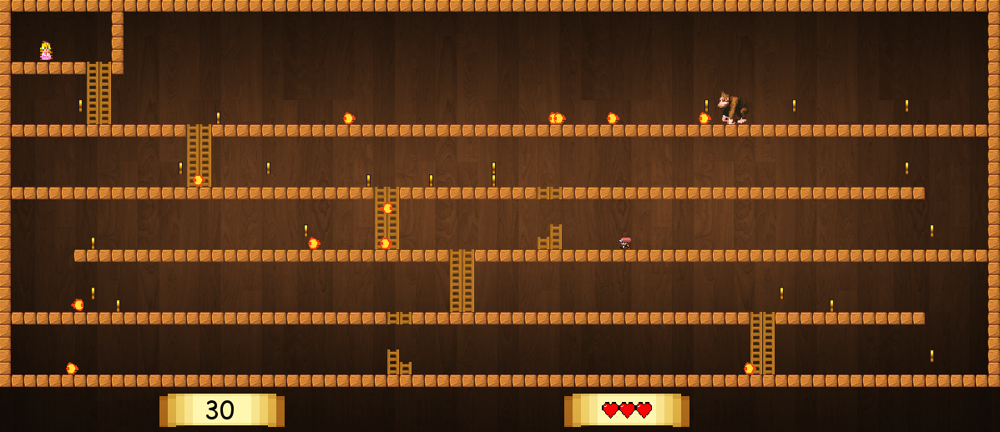

# DonkeyKong-Pygame
A spinoff of the original Donkey Kong game, which is simpler than the original. The codebase is written in python (pygame).

### Usage
Run `python Game.py` to start the game.

Instructions:
* Use wasd keys to move around and climb ladders.
* Use space to jump.

Note: 
The images used in the game have not been designed by me, I do not claim any rights over them.
